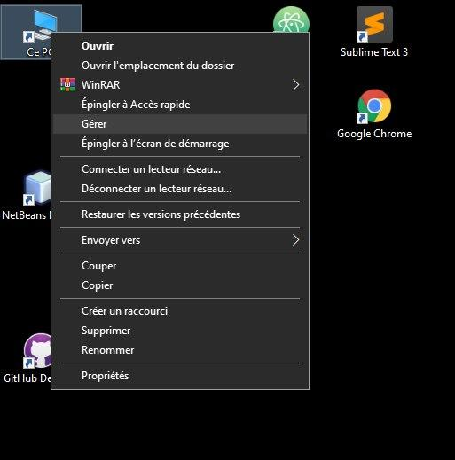
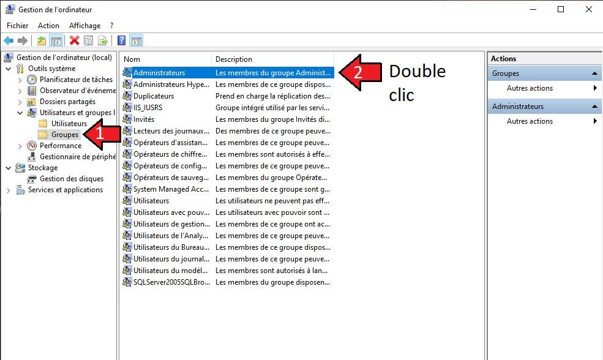
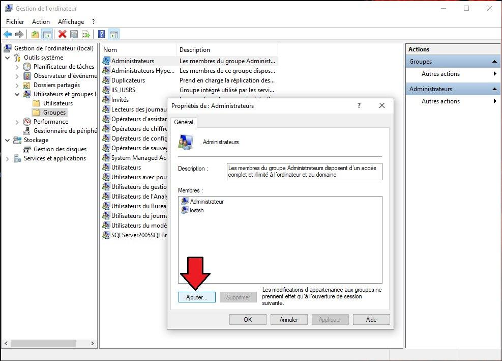
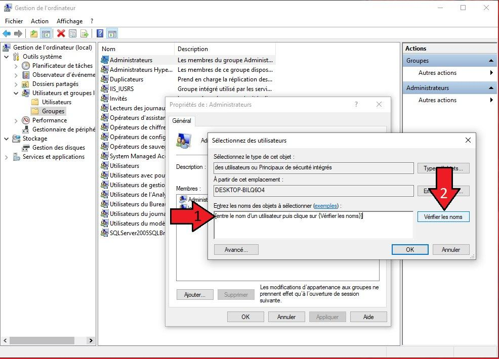
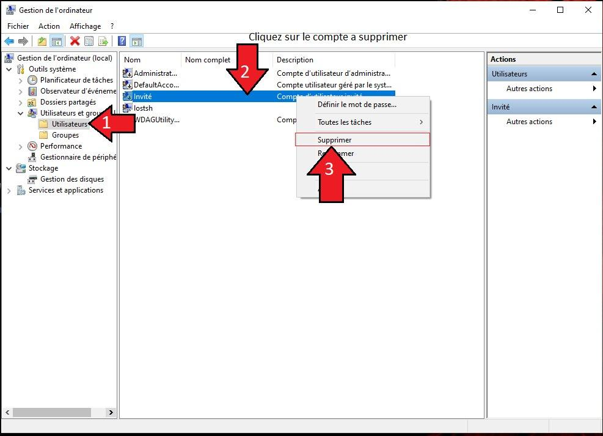

# Supprimer un utilisateur Windows

1. [Création d'un utilisateur avec privilèges administrateur](Création-de-l'utilisateur-avec-privilèges-administrateur)
2. [Se connecter avec le profil de l'utilisateur ayant droit administrateur](Connection-sur-le-profil-qui-est-administeur)
3. [Supprimer le profile indésirable](Suppression-de-l'utilisateur-indésirable)

> Cette procédure s'applique a des systèmes Windows 10, elle n'est pas garantie pour des systèmes anterieurs.

:warning: Pour effectuer cette manipulation vous devez disposer **d'au moins `deux` utilisateurs**.

>> A titre personnel je trouve qu'il est plus simple de disposer d'un troisième compte. 
Le premier : un compte normal qui est sur la machine et que l'on ne modifie pas. (On effectue l'etape 1 depuis ce compte) 
Le second : un compte auquel nous allons donner les privilèges administrateur. 
Le dernier : le compte a supprimer

   

## Création de l'utilisateur avec privilèges administrateur

- Commencez par créer un **profil utilisateur de manière classique**, une fois que vous disposez d'un utilisateur suivez la procédure suivante pour le dotter des privlilèges administrateur.

 

*Accedez au panneau de `Gestion de l'ordinateur`*

 

-> Développez **Utilisateurs et groupes locaux**
1. Cliquez sur **Groupes**
2. *Double cliquez* sur le groupe nommé **Administrateur**

 

_Cliquez **Ajouter**_

 

1. *Entrez le nom de l'utilisateur* auquel vous voulez donner les privilèges administrateur
2. *cliquez* sur **Vérifier les noms**
3. *cliquez* **OK**

> Bravo, a présent si tout s'est bien déroulé, vous disposez d'**un utilisateur ayant les droits administrateurs**

## Connection sur le profil qui est administeur

- Déconnectez vous du profil sur lequel vous étiez connecté, et veillez à **bien fermer** la session

- Puis connectez vous avec **l'utilisateur quel vous avez donné les droits d'administrateur** a l'étape précédente.

## Suppression de l'utilisateur indésirable

*Accedez au panneau de `Gestion de l'ordinateur`*

 

1. *Cliquez* sur **Utilisateurs**
2. *Selectionez* l'utilisateur que vous voulez **suprimer**
3. *Cliquez droit dessus* et choisissez **supprimer**

            

Si vous avez de modifications a soumettre, ou que vous avez constater des erreures, n'hésitez pas a proposer des corrections sur le [dépot](https://github.com/lostsh/winDeleteUser)